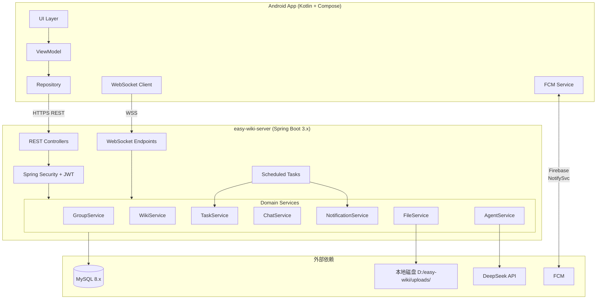
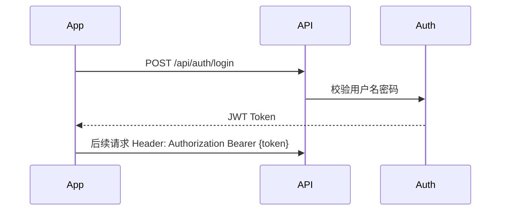
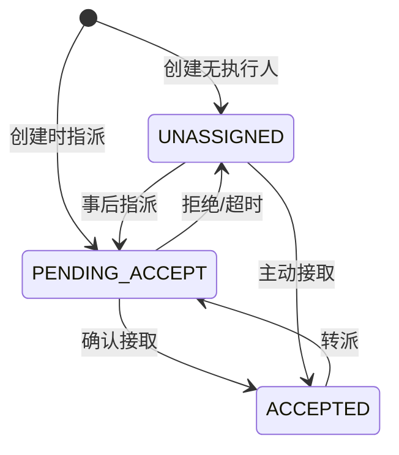
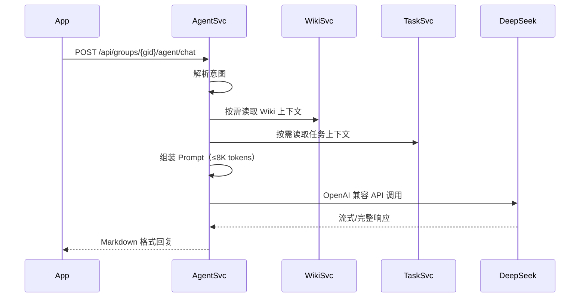
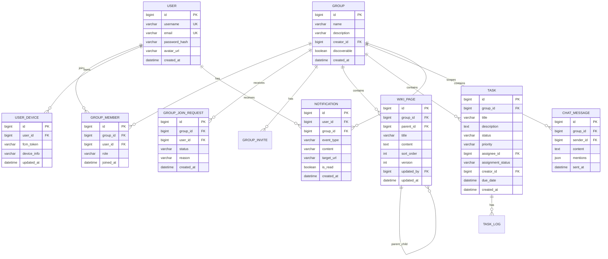
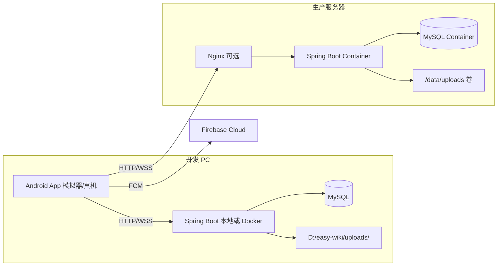
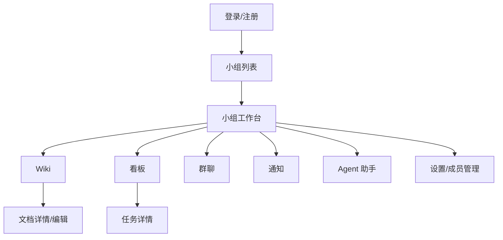

# Easy-wiki 概要设计文档

| 版本 | 日期 | 状态 |
|------|------|------|
| V1.0 | 2026-07-06 | 待评审 |

> 基于 `prd/prd-v1.0.md`，经技术选型确认后输出的系统概要设计。

---

## 1. 设计目标与范围

### 1.1 目标

构建轻量化团队知识库与工作协同平台，支持私有化 Docker 部署，用户通过 **Android 原生 App** 完成 Wiki 阅读编辑、任务协作、群聊沟通与 Agent 辅助。

### 1.2 V1.0 范围

| 模块 | 纳入 | 说明 |
|------|------|------|
| 小组管理 | ✅ | 创建、邀请、申请加入、审批、组间隔离 |
| Wiki 知识库 | ✅ | Markdown、目录树、搜索；**不含**版本回溯 |
| 任务看板 | ✅ | CRUD、状态流转、优先级、截止提醒 |
| 工作指派 | ✅ | 指派需确认接取、主动接取、转派 |
| 通知中心 | ✅ | 应用内 + WebSocket + FCM |
| 群聊 | ✅ | 文字消息、@提及 |
| Agent 助手 | ✅ | 任务整理、文档摘要、任务建议 |

### 1.3 已确认技术选型

| 层级 | 选型 | 备注 |
|------|------|------|
| Android 客户端 | **Kotlin + Jetpack Compose** | 方案 A |
| 后端运行时 | **Java 17** | 与 Spring Boot 3.x 配套 |
| 后端框架 | **Spring Boot 3.x** | 单体应用 |
| 持久层 | **Spring Data JPA** | Hibernate 实现 |
| 数据库 | **MySQL 8.x** | 关系型存储 |
| 认证 | **Spring Security + JWT** | 无状态 API 鉴权 |
| 实时通信 | **Spring WebSocket** | 群聊、前台通知 |
| 移动推送 | **FCM** | App 后台系统通知 |
| Agent LLM | **OpenAI 兼容 API** | 默认接入 **DeepSeek** |
| 文件存储 | **本地磁盘** | 开发默认 `D:/easy-wiki/uploads/` |
| Wiki 并发编辑 | **乐观锁** | `version` 字段校验 |

### 1.4 默认决策（低优先级待研究项）

| 编号 | 决策 | 说明 |
|------|------|------|
| R-004 | 邀请链接有效期 7 天 | 与 PRD 一致，可配置 |
| R-005 | 聊天记录全量持久化，默认加载最近 50 条 | 上滑分页加载更早消息 |
| R-007 | 入组申请 30 天未审批自动过期 | 可配置 |
| 仓库结构 | Monorepo | `easy-wiki-server` + `easy-wiki-android` |

---

## 2. 架构方案对比与选型

### 2.1 候选方案

| 方案 | 描述 | 优点 | 缺点 |
|------|------|------|------|
| **A. 分层单体（推荐）** | 一个 Spring Boot 应用，按领域分包；独立 Android 工程 | 部署简单、调试方便、符合 MVP | 单实例扩展性有限 |
| B. 模块化单体 | Spring Modulith 或严格模块边界 | 边界清晰，便于后续拆分 | V1.0 引入成本偏高 |
| C. 微服务 | 各模块独立服务 | 扩展性强 | 运维复杂，严重过度设计 |

### 2.2 选型结论

**采用方案 A：分层单体架构。**

理由：PRD 要求单机 Docker 一键部署、200 在线用户，单体足够；团队规模小，应优先交付速度。

---

## 3. 系统总体架构



### 3.1 架构原则

1. **小组数据隔离**：所有业务 API 携带 `groupId`，服务端校验成员身份
2. **前后端分离**：Android 仅通过 REST + WebSocket 通信，不直连数据库与 LLM
3. **推送双通道**：前台 WebSocket 实时；后台 FCM 系统通知
4. **配置外置**：数据库、JWT、DeepSeek API Key、上传路径均通过环境变量注入

---

## 4. 工程结构

### 4.1 Monorepo 目录规划

```
Easy-wiki/
├── prd/                          # 产品需求文档
├── docs/
│   └── superpowers/specs/        # 设计文档
├── easy-wiki-server/             # 后端 Spring Boot 工程
│   ├── src/main/java/com/easywiki/
│   │   ├── EasyWikiApplication.java
│   │   ├── config/               # Security, WebSocket, CORS, FCM
│   │   ├── controller/           # REST API
│   │   ├── websocket/            # WS 端点与处理器
│   │   ├── service/              # 业务逻辑
│   │   ├── repository/           # JPA Repository
│   │   ├── entity/               # JPA 实体
│   │   ├── dto/                  # 请求/响应对象
│   │   ├── security/             # JWT 过滤器、UserDetails
│   │   ├── agent/                # LLM 客户端、Prompt 组装
│   │   ├── scheduler/            # 截止提醒、申请过期
│   │   └── exception/            # 全局异常处理
│   ├── src/main/resources/
│   │   └── application.yml
│   └── Dockerfile
├── easy-wiki-android/            # Android 工程
│   └── app/src/main/java/com/easywiki/
│       ├── ui/                   # Compose 页面
│       ├── viewmodel/
│       ├── data/                 # Repository, API, WS
│       ├── model/
│       ├── navigation/
│       └── service/              # FCM Service
├── docker-compose.yml
└── README.md
```

### 4.2 后端分层职责

| 层 | 职责 |
|----|------|
| Controller | 参数校验、鉴权上下文、调用 Service、返回统一响应 |
| Service | 业务逻辑、事务、触发通知与事件 |
| Repository | JPA 数据访问 |
| Entity | 数据库表映射 |
| DTO | API 入参出参，与 Entity 隔离 |

### 4.3 Android 分层职责

| 层 | 职责 |
|----|------|
| UI (Compose) | 页面渲染、用户交互 |
| ViewModel | 状态管理、调用 Repository |
| Repository | 聚合 REST + WebSocket 数据源 |
| Data (API/WS) | Retrofit 接口、OkHttp WebSocket 客户端 |

---

## 5. 技术栈明细

### 5.1 后端依赖

| 组件 | 技术 | 版本建议 |
|------|------|----------|
| 框架 | Spring Boot | 3.2.x |
| ORM | Spring Data JPA | 随 Boot |
| 安全 | Spring Security + jjwt | — |
| WebSocket | spring-boot-starter-websocket | — |
| 数据库驱动 | mysql-connector-j | 8.x |
| 校验 | jakarta.validation | — |
| LLM | Spring AI 或 OkHttp 直调 | OpenAI 兼容格式 |
| FCM | Firebase Admin SDK | 服务端推送 |
| 工具 | Lombok, MapStruct（可选） | — |

### 5.2 Android 依赖

| 组件 | 技术 |
|------|------|
| UI | Jetpack Compose + Material 3 |
| 架构 | ViewModel + StateFlow |
| 导航 | Navigation Compose |
| 网络 | Retrofit 2 + OkHttp 4 |
| WebSocket | OkHttp WebSocket |
| 序列化 | Kotlinx Serialization 或 Moshi |
| 本地存储 | DataStore Preferences |
| 推送 | Firebase Messaging |
| Markdown | Markwon（Wiki 渲染） |
| 图片加载 | Coil |

### 5.3 开发与运行环境

| 环境 | 要求 |
|------|------|
| JDK | 17 |
| Android Studio | 最新稳定版 |
| Android SDK | API 26–34 |
| Docker Desktop | 后端容器化部署 |
| MySQL | 8.0（Docker 或本地） |

---

## 6. 模块设计

### 6.1 用户与认证

**功能**：注册、登录、JWT 签发与刷新、用户信息。



| 接口 | 方法 | 说明 |
|------|------|------|
| `/api/auth/register` | POST | 注册 |
| `/api/auth/login` | POST | 登录，返回 JWT |
| `/api/users/me` | GET | 当前用户信息 |

**安全要点**：密码 BCrypt；JWT 默认 7 天有效；登录接口限流。

---

### 6.2 小组管理

**核心实体**：`Group`、`GroupMember`、`GroupJoinRequest`、`GroupInvite`

| 功能 | 关键逻辑 |
|------|----------|
| 创建小组 | 创建者 → role=ADMIN；初始化 Wiki 根节点 |
| 邀请加入 | 生成 token + 过期时间（7 天）；点击直接加入 |
| 申请加入 | 写入 `GroupJoinRequest(status=PENDING)`；通知管理员 |
| 审批 | APPROVED → 创建 GroupMember；REJECTED → 通知申请人 |
| 组间隔离 | 拦截器校验 `(userId, groupId)` 成员关系 |

| 接口前缀 | 说明 |
|----------|------|
| `/api/groups` | 小组 CRUD、列表、切换 |
| `/api/groups/{id}/members` | 成员管理 |
| `/api/groups/{id}/join-requests` | 申请与审批 |
| `/api/groups/invites/{token}` | 邀请加入 |

---

### 6.3 Wiki 知识库

**核心实体**：`WikiPage`（树状 `parent_id`）、`WikiDraft`（可选，自动保存草稿）

| 字段 | 说明 |
|------|------|
| id, group_id, parent_id | 树结构 |
| title, content | Markdown 正文 |
| sort_order | 同级排序 |
| version | 乐观锁版本号 |
| updated_by, updated_at | 更新追踪 |

**乐观锁流程**：

1. 客户端读取页面，获取 `version`
2. 保存时提交 `version`
3. 服务端 `UPDATE ... WHERE id=? AND version=?`
4. 影响行数=0 → 返回 409 冲突，提示刷新合并

| 接口 | 说明 |
|------|------|
| `/api/groups/{gid}/wiki/tree` | 目录树 |
| `/api/groups/{gid}/wiki/pages` | 创建页面 |
| `/api/groups/{gid}/wiki/pages/{id}` | 读/改/删 |
| `/api/groups/{gid}/wiki/search` | 标题+正文搜索 |
| `/api/groups/{gid}/wiki/upload` | 图片上传 |

**图片上传**：存 `D:/easy-wiki/uploads/{groupId}/{uuid}.{ext}`，返回可访问 URL。

---

### 6.4 任务与看板

**核心实体**：`Task`、`TaskLog`（状态变更记录）

| 字段 | 说明 |
|------|------|
| status | TODO / IN_PROGRESS / DONE |
| priority | LOW / MEDIUM / HIGH / URGENT |
| assignment_status | UNASSIGNED / PENDING_ACCEPT / ACCEPTED / REJECTED |
| assignee_id | 执行人 |
| due_date | 截止日期 |

**指派状态机**：



**定时任务**（Scheduler）：
- 截止前 24h、当天 9:00 发送提醒
- 指派 7 天未确认 → 回到 UNASSIGNED

| 接口前缀 | 说明 |
|----------|------|
| `/api/groups/{gid}/tasks` | 任务 CRUD |
| `/api/groups/{gid}/tasks/{id}/assign` | 指派 |
| `/api/groups/{gid}/tasks/{id}/accept` | 确认接取 |
| `/api/groups/{gid}/tasks/{id}/reject` | 拒绝接取 |
| `/api/groups/{gid}/tasks/{id}/claim` | 主动接取 |

---

### 6.5 通知中心

**核心实体**：`Notification`、`UserDevice`（FCM token）

**事件驱动**：各 Service 在业务操作后调用 `NotificationService.publish(event)`。

| 通道 | 场景 |
|------|------|
| 数据库记录 | 所有通知持久化 |
| WebSocket | App 前台实时推送 |
| FCM | App 后台系统栏推送 |

**WebSocket 消息格式**：

```json
{
  "type": "NOTIFICATION",
  "payload": {
    "id": 1,
    "eventType": "TASK_ASSIGNED",
    "content": "张三将任务「接口联调」指派给你",
    "targetUrl": "/tasks/42",
    "groupId": 3
  }
}
```

| 接口 | 说明 |
|------|------|
| `/api/notifications` | 通知列表、标已读 |
| `/api/devices` | 注册 FCM Token |
| `WS /ws?token={jwt}` | WebSocket 连接 |

---

### 6.6 群聊

**核心实体**：`ChatMessage`

| 字段 | 说明 |
|------|------|
| group_id | 小组频道 |
| sender_id | 发送者 |
| content | 纯文本 ≤2000 字符 |
| mentions | JSON 数组，@用户 ID 列表 |
| sent_at | 发送时间 |

**实时流程**：
1. 客户端经 WebSocket 发送 `CHAT_MESSAGE`
2. 服务端持久化 → 广播给同组在线成员
3. 解析 mentions → 触发 @通知

| 接口 | 说明 |
|------|------|
| `/api/groups/{gid}/chat/messages` | 历史消息分页 |
| `WS 消息类型 CHAT_MESSAGE` | 实时收发 |

---

### 6.7 Agent 助手

**架构**：服务端代理模式，Android 不持有 API Key。



**意图类型（V1.0）**：

| 意图 | 处理 |
|------|------|
| 任务整理 | 注入当前组任务列表到 Prompt |
| 文档摘要 | 按标题/ID 加载 Wiki 页面内容 |
| 任务建议 | 加载指定 Wiki 文档，输出结构化任务 JSON |
| 通用问答 | 注入组内公开数据摘要 |

**配置项**（环境变量）：

```yaml
agent:
  enabled: true
  api-base-url: https://api.deepseek.com
  api-key: ${DEEPSEEK_API_KEY}
  model: deepseek-chat
  max-tokens: 8192
  timeout: 30s
```

| 接口 | 说明 |
|------|------|
| `/api/groups/{gid}/agent/chat` | 发送消息，返回回复 |
| `/api/groups/{gid}/agent/tasks/create` | 从建议批量创建任务 |

---

## 7. 数据库设计

### 7.1 ER 关系



### 7.2 索引策略

| 表 | 索引 | 用途 |
|----|------|------|
| group_member | (group_id, user_id) UNIQUE | 成员校验 |
| wiki_page | (group_id, parent_id) | 目录树查询 |
| task | (group_id, status) | 看板列查询 |
| notification | (user_id, is_read, created_at) | 通知列表 |
| chat_message | (group_id, sent_at) | 历史消息分页 |

---

## 8. API 设计规范

### 8.1 通用约定

| 项 | 规范 |
|----|------|
| 基础路径 | `/api/v1/` |
| 认证 | `Authorization: Bearer {jwt}` |
| 响应格式 | `{ "code": 0, "message": "ok", "data": {} }` |
| 错误码 | 400 参数错误、401 未认证、403 无权限、409 冲突、500 服务错误 |
| 分页 | `?page=0&size=20`，返回 `totalElements` |
| 时间格式 | ISO 8601，`2026-07-06T12:00:00+08:00` |

### 8.2 小组上下文

除认证接口外，业务接口路径均包含 `groupId` 或在 body 中携带，服务端统一校验成员资格。

---

## 9. WebSocket 设计

### 9.1 连接

- 端点：`wss://{host}/ws`
- 鉴权：Query 参数 `token={jwt}` 或首帧 AUTH 消息
- 心跳：客户端每 30s 发送 PING，服务端 PONG

### 9.2 消息类型

| type | 方向 | 说明 |
|------|------|------|
| PING / PONG | 双向 | 心跳 |
| CHAT_MESSAGE | 双向 | 群聊消息 |
| NOTIFICATION | S→C | 实时通知 |
| ERROR | S→C | 错误信息 |

### 9.3 会话管理

- 服务端按 `userId` 维护连接映射
- 同一用户允许多设备连接
- 群聊广播：查组成员 → 推送至在线连接

---

## 10. 部署架构



### 10.1 Docker Compose（生产）

```yaml
services:
  mysql:
    image: mysql:8.0
    volumes: [mysql-data:/var/lib/mysql]
  app:
    build: ./easy-wiki-server
    ports: ["8080:8080"]
    environment:
      - SPRING_DATASOURCE_URL=jdbc:mysql://mysql:3306/easywiki
      - DEEPSEEK_API_KEY=${DEEPSEEK_API_KEY}
      - UPLOAD_PATH=/data/uploads
    volumes: [upload-data:/data/uploads]
volumes:
  mysql-data:
  upload-data:
```

### 10.2 配置项

| 变量 | 说明 | 开发默认值 |
|------|------|------------|
| `UPLOAD_PATH` | 文件上传目录 | `D:/easy-wiki/uploads/` |
| `JWT_SECRET` | JWT 签名密钥 | 本地随机生成 |
| `DEEPSEEK_API_KEY` | DeepSeek API 密钥 | — |
| `FCM_CREDENTIALS` | Firebase 服务账号 JSON 路径 | — |

---

## 11. Android App 结构设计

### 11.1 页面导航



### 11.2 首次启动流程

1. 配置服务端地址（如 `http://192.168.1.100:8080`）
2. 登录 / 注册
3. 选择或创建小组
4. 进入工作台

### 11.3 关键实现要点

| 模块 | 实现 |
|------|------|
| 网络 | Retrofit + OkHttp Interceptor 注入 JWT |
| WebSocket | 单例管理，前台自动连接，后台断开 |
| FCM | `FirebaseMessagingService` 处理推送，Deep Link 跳转 |
| Wiki 阅读 | Markwon 渲染 Markdown |
| Wiki 编辑 | V1.0 基础 TextField + 预览（逐步增强） |
| 看板 | LazyColumn 分列或 Tab 切换三列 |
| 状态 | ViewModel + StateFlow |

---

## 12. 非功能设计

### 12.1 性能

| 指标 | 手段 |
|------|------|
| API P95 < 500ms | JPA 查询优化、索引、分页 |
| 看板 < 1.5s | 按 group+status 索引，单次 ≤100 条 |
| WS 延迟 < 1s | 轻量消息体，避免广播阻塞 |

### 12.2 安全

| 项 | 手段 |
|----|------|
| 传输加密 | 生产 HTTPS |
| 鉴权 | JWT + 组成员校验 |
| XSS | Wiki 渲染白名单过滤 |
| 限流 | Bucket4j 或 Spring 限流，登录 5次/分钟 |
| API Key | DeepSeek Key 仅服务端，环境变量注入 |

### 12.3 可观测性

- Spring Actuator `/actuator/health`
- 结构化日志（请求 ID、userId、groupId）
- 关键异常告警（LLM 调用失败、FCM 发送失败）

---

## 13. 实施阶段规划

| 阶段 | 内容 | 预估 |
|------|------|------|
| **P1 基础骨架** | 工程初始化、认证、小组 CRUD、Docker | 1–2 周 |
| **P2 核心协作** | Wiki、任务看板、工作指派 | 2–3 周 |
| **P3 实时能力** | 群聊 WebSocket、通知中心、FCM | 1–2 周 |
| **P4 智能助手** | Agent 接入 DeepSeek、任务建议创建 | 1 周 |
| **P5 联调发布** | 端到端测试、APK 打包、部署文档 | 1 周 |

**建议实施顺序**：P1 → P2 → P3 → P4 → P5，Android 与后端可并行开发（Mock API 先行）。

---

## 14. 风险与应对

| 风险 | 影响 | 应对 |
|------|------|------|
| FCM 依赖 Google 服务 | 国内部分设备推送受限 | 应用内通知 + WebSocket 兜底；V1.1 评估厂商推送 |
| DeepSeek API 不可用 | Agent 功能失效 | `agent.enabled=false` 开关，优雅降级 |
| 乐观锁冲突频繁 | Wiki 编辑体验差 | 提示合并；V1.1 考虑编辑锁定 |
| 私有化无公网 | FCM/DeepSeek 需出网 | 部署文档说明网络要求；Agent 可换本地 Ollama |
| 磁盘占满 | 图片上传失败 | 上传前检查剩余空间；管理端清理策略 |

---

## 15. 验收标准

- [ ] Android 8.0+ 设备安装 APK 可完成注册登录
- [ ] 小组创建、邀请、申请审批流程通畅
- [ ] Wiki 目录树、Markdown 阅读、搜索可用
- [ ] 看板任务 CRUD、指派确认接取、拖拽流转可用
- [ ] 群聊实时收发、@通知可用
- [ ] 前台 WebSocket + 后台 FCM 通知可达
- [ ] Agent 可整理任务、摘要 Wiki、建议任务并创建
- [ ] `docker-compose up` 30 分钟内完成后端部署
- [ ] 图片上传至配置路径（开发 `D:/easy-wiki/uploads/`）正常

---

## 附录：技术选型确认记录

| 日期 | 决策项 | 结果 |
|------|--------|------|
| 2026-07-06 | Android 客户端 | Kotlin + Jetpack Compose |
| 2026-07-06 | 后端持久层 | Spring Data JPA |
| 2026-07-06 | Agent LLM | OpenAI 兼容 API，默认 DeepSeek |
| 2026-07-06 | 文件存储 | 本地磁盘，开发路径 `D:/easy-wiki/uploads/` |
| 2026-07-06 | Wiki 并发编辑 | 乐观锁 |
