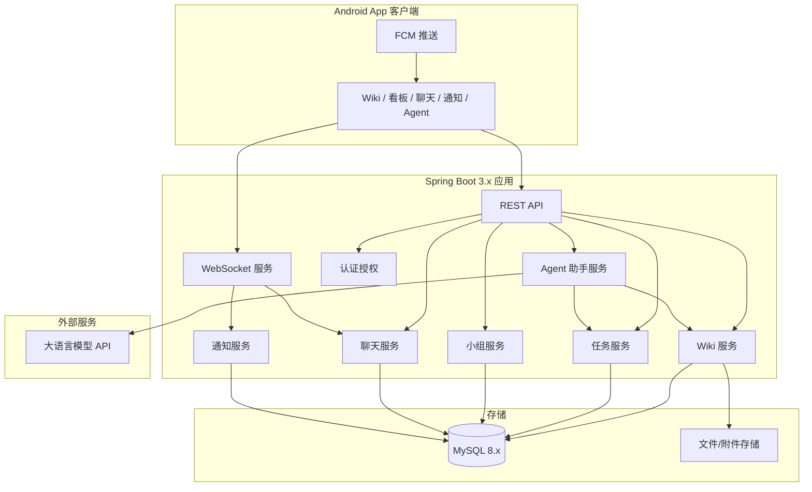
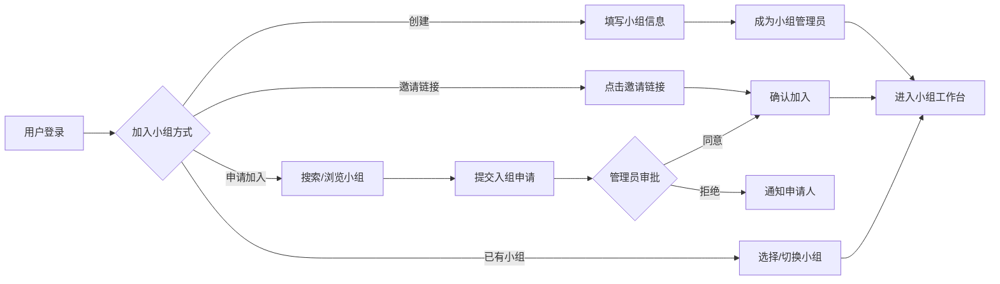
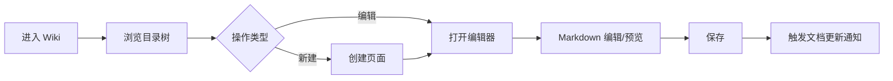
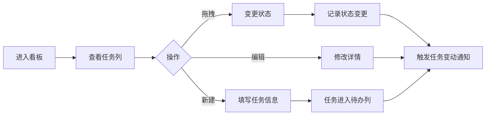
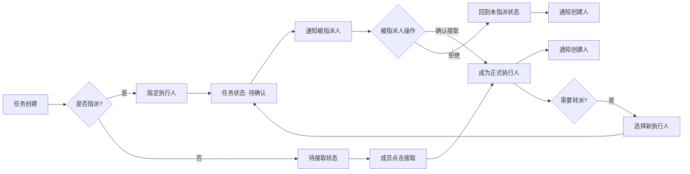
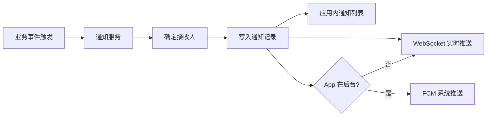
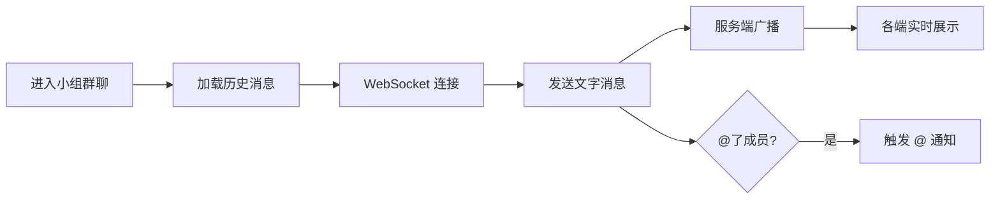
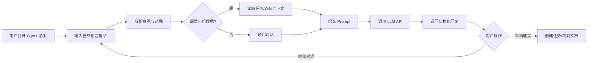
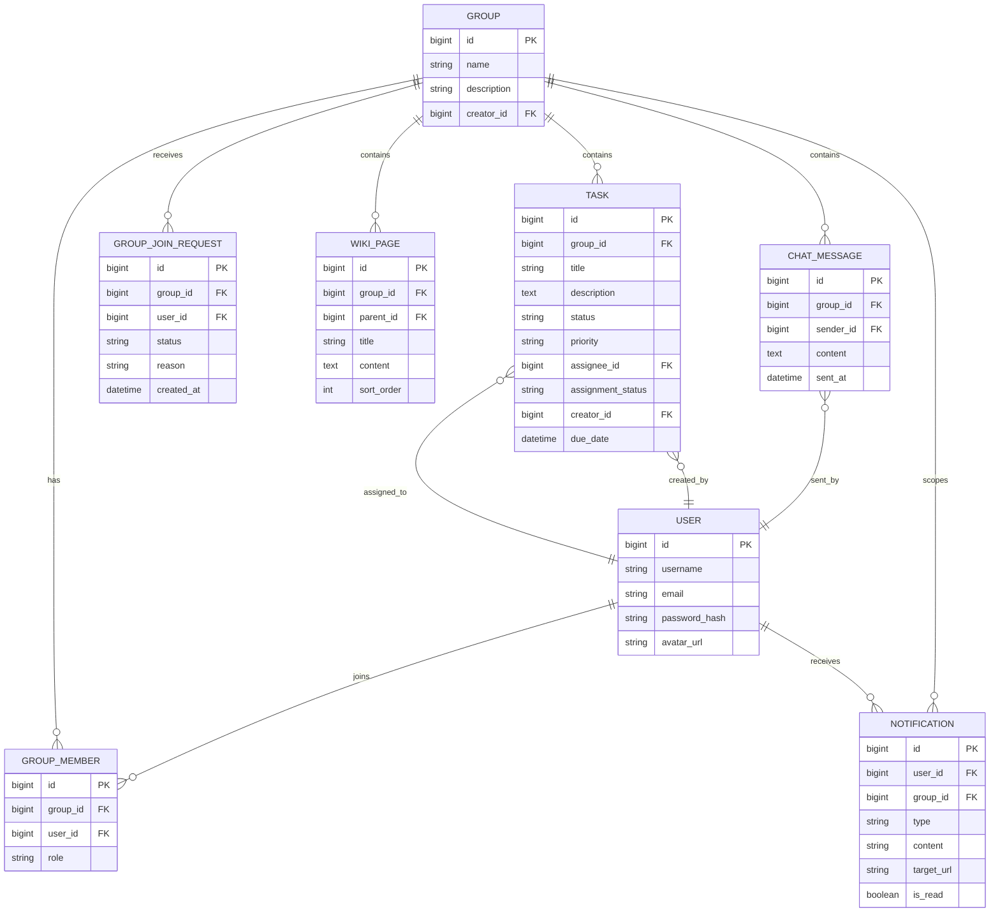

# Easy-wiki 产品需求文档

> 轻量化团队知识库与工作协同平台

## 1. 文档信息

| 版本号 | 创建日期 | 负责人 | 状态 |
|--------|----------|--------|------|
| V1.0 | 2026-07-06 | 待定 | 待评审 |

## 2. 修订历史

| 版本 | 修订内容 | 修订时间 | 修订人 |
|------|----------|----------|--------|
| V1.0 | 初稿创建，覆盖 Wiki、协同、通知、小组、群聊六大模块 | 2026-07-06 | 待定 |
| V1.1 | 新增申请加入小组、指派确认接取、Agent 助手；Wiki 版本回溯移至后续版本 | 2026-07-06 | 待定 |
| V1.2 | 目标平台调整为 Android 原生 App，更新平台兼容性与客户端技术选型 | 2026-07-06 | 待定 |

## 3. 名词解释

| 术语 | 解释 |
|------|------|
| 小组 | 用户自行创建的团队空间，组内 Wiki、任务、聊天相互独立 |
| Wiki 页面 | 以 Markdown 编写的知识文档，支持树状目录组织 |
| 看板 | 按任务状态（待办 / 进行中 / 已完成等）分列展示的可视化面板 |
| 任务指派 | 将 Todo 任务指定给某位成员；被指派人需确认后方为正式接取；未指派任务成员可主动接取 |
| 指派待确认 | 任务已指定执行人，但执行人尚未确认接取的中间状态 |
| 入组申请 | 用户主动向小组提交加入请求，需小组管理员审批通过后成为成员 |
| 系统推送 | 任务变动、文档更新等事件触发的多端通知 |
| Agent 助手 | 基于大语言模型的智能助手，帮助用户整理工作任务与 Wiki 资料 |
| 页面版本 | Wiki 文档每次保存产生的历史快照，支持查看与回滚（V1.1 规划） |

## 4. 产品概述

### 4.1 产品背景

#### 市场现状

中小型团队在知识沉淀与日常协作上常面临两难：一方面，Notion、Confluence 等功能完备但部署重、学习成本高；另一方面，飞书文档、语雀等 SaaS 方案数据托管在第三方，对注重私有化部署的团队不够友好。同时，Wiki 与任务管理往往分散在不同工具中，成员需要在多个应用间切换，信息割裂、协作效率低。

#### 问题与机会

- **部署门槛高**：传统企业 Wiki 需要复杂的基础设施与运维能力
- **工具割裂**：文档管理与任务协同分离，上下文难以串联
- **移动端体验弱**：一线成员更习惯在手机上查看文档、处理任务，多数自建方案移动端支持不足
- **小组隔离需求**：多项目、多小组并行时，需要清晰的数据与权限边界

#### 为什么是现在

Spring Boot 3.x 生态成熟，配合 MySQL 可实现轻量、可私有化的一键部署；Android 原生 App 可与 Java 后端共享技术栈，通过 REST + WebSocket 高效对接。团队对「小而全」的协作工具需求明确，Easy-wiki 有机会以「部署简单、上手即用」切入这一细分市场。

#### 我们的优势

- 后端统一采用 Spring Boot 3.x + MySQL，运维简单、团队技术栈一致
- Wiki 与 Todo / 看板、群聊、通知集成在同一小组空间内，减少工具切换
- 支持用户自助创建小组，天然适配多项目组并行场景
- Android 原生 App 设计，满足随时查阅文档、处理任务、接收推送的需求

### 4.2 产品目标

#### 业务目标

| 目标 | 指标 | 说明 |
|------|------|------|
| 降低部署成本 | 单机 Docker 一键启动，部署时间 < 30 分钟 | 含后端、数据库；Android 客户端通过 APK 分发 |
| 提升协作效率 | 小组内文档更新到成员感知延迟 < 5 秒（推送） | 依赖通知中心 |
| 提高任务闭环率 | 支持任务指派、截止提醒，减少任务遗漏 | V1.0 以功能完备为主，上线后收集数据 |
| 支撑多小组并行 | 单实例支持 ≥ 50 个小组、每小组 ≥ 100 名成员 | 初期容量目标 |

#### 用户目标

- 快速搭建团队 Wiki，用 Markdown 沉淀知识
- 在同一平台完成任务创建、指派、跟踪与完成
- 通过通知及时感知文档与任务变化
- 在小组群聊中快速沟通，减少外部 IM 依赖
- 在 Android 手机上完成主要操作（查看文档、处理任务、收通知）
- 借助 Agent 助手快速整理任务与文档，降低信息整理成本

### 4.3 目标用户

| 用户角色 | 描述 | 核心诉求 |
|----------|------|----------|
| 小组创建者 / 管理员 | 发起小组、管理成员与权限 | 快速建组、邀请与审批入组申请、基础权限控制 |
| 知识贡献者 | 编写、维护 Wiki 文档 | Markdown 编辑、目录管理、内容检索 |
| 任务执行者 | 确认接取、完成被指派的任务 | 看板视图、截止提醒、状态更新 |
| 任务协调者 | 创建任务并指派给成员 | 优先级、截止日期、指派与流转 |
| 普通成员 | 浏览文档、参与聊天、处理个人任务 | 简单易用、Android App 体验流畅、通知及时 |

**典型用户画像**

- **用户**：5–30 人的创业团队或部门小组的技术负责人
- **场景**：需要私有化部署的内部知识库，同时管理迭代任务
- **痛点**：不想维护多套系统，希望一个平台解决文档 + 任务 + 沟通

### 4.4 用户痛点

| 痛点 | 具体表现 | Easy-wiki 应对 |
|------|----------|----------------|
| Wiki 搭建成本高 | 传统方案安装配置复杂，非运维人员难以独立完成 | Docker 一键部署，默认配置即可使用 |
| 文档与任务分离 | 需求文档在 Wiki，任务在另一工具，链接与上下文断裂 | 同一小组空间内 Wiki + Todo 共存 |
| 任务指派不清晰 | 口头分配、群消息淹没，责任人不明确 | 显式指派 + 确认接取机制 + 看板可视化 |
| 变更感知滞后 | 文档更新或任务状态变化，相关人不知道 | 多端通知中心，关键事件自动推送 |
| 多项目数据混杂 | 不同项目组文档、任务在同一空间难以隔离 | 小组独立，组间数据与成员隔离 |
| 移动端体验差 | 自建 Wiki 多为 PC 端，外出无法及时处理任务 | Android 原生 App，核心功能移动可用 |
| 信息整理负担重 | 任务与文档分散，难以快速归纳重点与行动项 | Agent 助手辅助整理任务、摘要文档 |

### 4.5 主要功能

| 模块 | 功能概要 | 优先级 |
|------|----------|--------|
| 小组管理 | 创建小组、邀请加入、申请加入（管理员审批）、组间隔离 | P0 |
| 团队知识库 (Wiki) | Markdown 编辑、树状目录、页面搜索 | P0 |
| 工作协同 (Todo / 看板) | 任务 CRUD、状态流转、优先级看板、截止提醒 | P0 |
| 工作指派 | 任务指派（需确认接取）、主动接取、转派 | P0 |
| Agent 助手 | 整理工作任务、归纳 Wiki 资料、对话式辅助 | P1 |
| 多端通知中心 | 任务 / 文档变更 / 入组申请推送 | P1 |
| 群聊系统 | 小组内文字实时聊天 | P1 |

### 4.6 技术架构概述

> 竞品分析按需求跳过，本节仅描述技术选型与架构约束。

#### 后端

- **框架**：Spring Boot 3.x（Java 17+）
- **数据库**：MySQL 8.x
- **持久层**：Spring Data JPA 或 MyBatis-Plus（实现阶段确定）
- **认证**：Spring Security + JWT
- **实时通信**：WebSocket（群聊、通知推送）
- **移动推送**：Firebase Cloud Messaging（FCM），服务端下发系统通知
- **AI 能力**：LLM API 集成（Agent 助手，OpenAI 兼容或国产大模型）
- **API 风格**：RESTful JSON

#### 客户端（Android App）

| 方案 | 说明 | 推荐度 |
|------|------|--------|
| **方案 A：Android 原生（推荐 V1.0）** | Kotlin/Java 开发独立 App，通过 REST + WebSocket 对接 Spring Boot 后端；支持 Material Design、FCM 系统推送 | ⭐⭐⭐⭐⭐ |
| 方案 B：uni-app / 跨端框架 | 一套代码编译为 Android App，后端仍为 Spring Boot | ⭐⭐⭐ |
| 方案 C：WebView 壳 + H5 | Android 壳内嵌 H5 页面，快速交付但体验与性能弱于原生 | ⭐⭐ |

**V1.0 建议采用方案 A**：产品目标平台为 Android 系统软件 App，原生开发可充分利用系统推送、后台通知与移动端交互能力，并与 Java 后端技术栈保持一致。

**客户端技术要点**：
- UI 框架：Jetpack Compose 或传统 View 体系（实现阶段确定）
- 网络：Retrofit / OkHttp（REST）、OkHttp WebSocket
- 本地存储：SharedPreferences / DataStore（Token、服务端地址等配置）
- 推送：Firebase Cloud Messaging（FCM）
- 分发：APK 侧载安装，适配私有化部署场景

#### 部署

- Docker Compose：Spring Boot 应用 + MySQL +（可选）Nginx 反向代理
- 支持单机私有化部署，配置文件外置

#### 系统架构图

## 5. 功能需求

### 5.1 小组管理

#### 功能概述

用户可自助创建多个独立小组，也可通过邀请链接或主动申请的方式加入小组。每个小组拥有独立的成员列表、Wiki 空间、任务看板、群聊频道和通知范围。小组之间数据完全隔离，用户可加入多个小组并在组间切换。

加入小组有两种路径：
1. **邀请加入**：管理员生成邀请链接，用户点击后直接加入
2. **申请加入**：用户搜索或浏览可发现的小组，提交入组申请，经小组管理员审批通过后方可加入

#### 用户场景

**场景 1：创建新项目组**

- **用户**：小组创建者
- **背景**：新立项需要独立协作空间
- **目标**：5 分钟内完成小组创建并邀请成员
- **行为**：
  1. 点击「创建小组」，填写名称、简介
  2. 生成邀请链接或邀请码
  3. 将链接发送给成员，成员点击加入
- **结果**：新小组就绪，成员可访问组内 Wiki、任务、聊天
- **痛点**：以往需在多个工具分别建群、建空间

**场景 2：主动申请加入小组**

- **用户**：希望加入某项目组的成员
- **背景**：得知「产品研发组」在平台上运作，希望参与协作
- **目标**：提交入组申请并等待审批
- **行为**：
  1. 在「发现小组」中搜索目标小组名称
  2. 查看小组简介，点击「申请加入」
  3. 可选填写申请理由
  4. 等待管理员审批
- **结果**：管理员同意后成为正式成员，可访问组内全部功能；被拒绝则收到通知
- **痛点**：仅有邀请制时，用户无法主动表达加入意愿

**场景 3：管理员审批入组申请**

- **用户**：小组管理员
- **背景**：收到新成员的入组申请
- **目标**：审核申请并决定是否接纳
- **行为**：
  1. 在通知中心或「入组申请」列表查看待审批申请
  2. 查看申请人信息与申请理由
  3. 点击「同意」或「拒绝」
- **结果**：同意后申请人成为成员；拒绝后申请人收到说明

**场景 4：多小组切换**

- **用户**：同时参与多个项目的成员
- **背景**：在「产品组」和「研发组」两个小组中均有身份
- **目标**：快速切换当前工作上下文
- **行为**：在小组切换器中选择目标小组
- **结果**：界面展示该组的 Wiki、任务、聊天，不泄露其他组数据

#### 功能流程

**流程说明**：

1. 用户注册 / 登录后，若无小组可引导创建或申请加入
2. 创建者自动成为小组管理员
3. 管理员可生成邀请链接；被邀请用户确认后直接加入
4. 用户可搜索可发现的小组并提交入组申请，管理员审批通过后加入
5. 用户可在已加入的小组间切换，切换后所有模块数据限定在当前小组

#### 前置条件

- 用户已完成注册并登录
- 创建小组需填写必填项：小组名称（2–50 字符）

#### 后置条件

- 小组记录写入数据库，创建者与小组建立管理员关系
- 默认初始化：空 Wiki 根目录、默认看板列、空群聊频道

#### 功能细则

| 编号 | 需求描述 | 验收标准 |
|------|----------|----------|
| GRP-001 | 用户可创建小组 | 填写名称、可选简介后创建成功，创建者为管理员 |
| GRP-002 | 用户可通过邀请链接加入小组 | 链接有效期内点击加入，成员列表可见新成员 |
| GRP-003 | 用户可申请加入小组 | 对可发现的小组提交申请，可选填申请理由，状态为「待审批」 |
| GRP-004 | 管理员审批入组申请 | 管理员可同意或拒绝；同意后申请人成为成员，拒绝后通知申请人 |
| GRP-005 | 用户可加入多个小组 | 小组列表展示所有已加入小组，可切换 |
| GRP-006 | 小组数据隔离 | A 组成员无法访问 B 组 Wiki、任务、聊天记录 |
| GRP-007 | 管理员可移除成员 | 移除后该成员失去该小组所有访问权限 |
| GRP-008 | 管理员可解散小组 | 二次确认后解散，组内数据按策略归档或删除 |
| GRP-009 | 用户可主动退出小组 | 退出后不再接收该组通知 |
| GRP-010 | 小组可发现性设置 | 管理员可设置小组为「可被发现」或「仅邀请加入」，默认可被发现 |

#### 异常场景

| 异常情况 | 触发条件 | 处理方式 | 用户提示 |
|----------|----------|----------|----------|
| 小组名称重复 | 同一用户下已存在同名小组 | 拒绝创建 | 「您已拥有同名小组，请更换名称」 |
| 邀请链接过期 | 链接超过有效期（默认 7 天） | 拒绝加入 | 「邀请链接已失效，请联系管理员重新生成」 |
| 重复申请 | 用户已提交待审批申请 | 拒绝重复提交 | 「您已提交申请，请等待审批」 |
| 已是成员 | 用户已是该小组成员 | 拒绝申请 | 「您已是该小组成员」 |
| 申请被拒绝 | 管理员拒绝入组申请 | 更新申请状态，通知申请人 | 「您的入组申请未通过」 |
| 小组不可发现 | 小组设置为仅邀请加入 | 搜索不可见，无法申请 | — |
| 小组人数达上限 | 成员数超过配置上限（默认 100） | 拒绝加入 | 「小组人数已满」 |
| 非成员访问组资源 | 直接访问 URL 但非成员 | 返回 403 | 「您不是该小组成员，无权访问」 |

---

### 5.2 团队知识库 (Wiki)

#### 功能概述

小组内提供 Wiki 知识库，支持 Markdown 语法编写页面，以树状目录组织文档结构。V1.0 聚焦编辑、目录管理与搜索；历史版本查看与回滚功能规划于 V1.1 实现。

#### 用户场景

**场景 1：编写技术文档**

- **用户**：知识贡献者
- **背景**：需要记录 API 设计说明
- **目标**：创建文档并放入「技术文档 / 后端」目录下
- **行为**：
  1. 在 Wiki 目录树中右键「新建页面」
  2. 选择父级目录，输入标题
  3. 使用 Markdown 编辑器编写内容，实时预览
  4. 保存发布
- **结果**：团队成员可在目录树中找到并阅读该文档
- **痛点**：以往文档散落各处，格式不统一

#### 功能流程

#### 前置条件

- 用户为当前小组成员
- 新建页面需指定父节点（根目录除外）和标题

#### 后置条件

- 页面内容持久化
- 目录树结构更新
- 若内容有实质变更，向小组成员发送文档更新通知（可配置）

#### 功能细则

| 编号 | 需求描述 | 验收标准 |
|------|----------|----------|
| WIKI-001 | 支持 Markdown 语法 | 标题、列表、代码块、表格、链接、图片等常用语法正确渲染 |
| WIKI-002 | 树状目录管理 | 支持新建、重命名、移动、删除页面节点；删除父节点需处理子节点（禁止删除有子页面的节点，或级联删除需二次确认） |
| WIKI-003 | 编辑与预览 | 编辑模式支持分屏预览；Android App 端 V1.0 至少保证阅读体验完整，编辑能力逐步实现 |
| WIKI-004 | 自动保存草稿 | 编辑中每 30 秒自动保存草稿，防止意外丢失 |
| WIKI-005 | 页面搜索 | 支持按标题、正文关键词搜索当前小组 Wiki |
| WIKI-006 | 图片上传 | 支持本地上传图片，插入 Markdown 图片语法 |

> **V1.1 规划**：历史版本记录（WIKI-007）、版本对比 diff（WIKI-008）、版本回滚（WIKI-009）

#### Markdown 支持范围（V1.0）

- 基础：标题 H1–H6、粗体、斜体、删除线、引用、有序/无序列表
- 扩展：代码块（含语言标识）、表格、任务列表 `- [ ]`、分割线
- 链接：`[text](url)` 内部页面链接与外部链接
- 图片：``，支持本地上传

#### 异常场景

| 异常情况 | 触发条件 | 处理方式 | 用户提示 |
|----------|----------|----------|----------|
| 标题重复 | 同一父目录下标题已存在 | 拒绝保存 | 「同级目录下已存在同名页面」 |
| 并发编辑冲突 | 两人同时编辑同一页面 | 后保存者提示冲突，展示差异 | 「页面已被他人更新，请刷新后合并修改」 |
| 图片上传超限 | 单张 > 5MB 或格式不支持 | 拒绝上传 | 「图片需小于 5MB，支持 jpg/png/gif/webp」 |

---

### 5.3 工作协同 (Todo / 看板)

#### 功能概述

小组内提供任务管理能力，支持创建 Todo 任务、按状态流转、优先级看板视图展示，以及截止日期提醒。

#### 用户场景

**场景 1：在看板上管理迭代任务**

- **用户**：任务协调者
- **背景**：本周迭代有 8 项任务需跟踪
- **目标**：在看板上按状态直观查看进度
- **行为**：
  1. 进入「任务看板」
  2. 在各列（待办 / 进行中 / 已完成）查看任务卡片
  3. 拖拽卡片变更状态
- **结果**：团队对迭代进度一目了然

**场景 2：截止日期提醒**

- **用户**：任务执行者
- **背景**：任务明日到期
- **目标**：提前收到提醒，避免遗漏
- **行为**：系统在截止前 24 小时、截止当天各推送一次通知
- **结果**：用户及时处理任务

#### 功能流程

#### 看板列定义（V1.0 默认）

| 列名 | 状态值 | 说明 |
|------|--------|------|
| 待办 | `TODO` | 新建或未开始的任务 |
| 进行中 | `IN_PROGRESS` | 执行中的任务 |
| 已完成 | `DONE` | 已关闭的任务 |

状态流转规则：`TODO` → `IN_PROGRESS` → `DONE`；允许回退（如 `DONE` → `IN_PROGRESS`），回退需记录操作日志。

#### 任务字段

| 字段 | 类型 | 必填 | 说明 |
|------|------|------|------|
| 标题 | 文本 | 是 | 1–200 字符 |
| 描述 | 富文本/Markdown | 否 | 任务详情 |
| 状态 | 枚举 | 是 | 默认 `TODO` |
| 优先级 | 枚举 | 是 | `低` / `中` / `高` / `紧急`，默认 `中` |
| 执行人 | 用户 | 否 | 见 5.4 工作指派 |
| 指派状态 | 枚举 | 自动 | `UNASSIGNED` / `PENDING_ACCEPT` / `ACCEPTED` / `REJECTED` |
| 创建人 | 用户 | 自动 | 创建时记录 |
| 截止日期 | 日期时间 | 否 | 用于提醒 |
| 创建/更新时间 | 时间戳 | 自动 | 系统记录 |

#### 功能细则

| 编号 | 需求描述 | 验收标准 |
|------|----------|----------|
| TASK-001 | 创建任务 | 填写标题即可创建，默认进入待办列、优先级中 |
| TASK-002 | 看板视图 | 按状态分列展示，支持按优先级颜色标识 |
| TASK-003 | 列表视图 | 提供除看板外的列表视图，支持排序（截止日期、优先级、创建时间） |
| TASK-004 | 状态流转 | 拖拽或操作菜单变更状态，记录变更人与时间 |
| TASK-005 | 优先级筛选 | 看板 / 列表支持按优先级筛选 |
| TASK-006 | 截止提醒 | 截止前 24h、当天 9:00 各提醒一次（可配置时区，默认 Asia/Shanghai） |
| TASK-007 | 任务详情 | 点击卡片查看完整信息、操作历史 |
| TASK-008 | 删除任务 | 创建人或管理员可删除，二次确认 |

#### 异常场景

| 异常情况 | 触发条件 | 处理方式 | 用户提示 |
|----------|----------|----------|----------|
| 标题为空 | 创建时未填标题 | 拒绝创建 | 「请输入任务标题」 |
| 截止日期早于今天 | 用户选择过去日期 | 警告但允许创建 | 「截止日期早于今天，仍要创建吗？」 |
| 非法状态跳转 | 系统级约束（若有） | 按规则允许或拒绝 | 依据流转规则提示 |

---

### 5.4 工作指派

#### 功能概述

Todo 任务支持在团队成员间指派与接取。任务指派后，被指派人须**确认接取**后方成为正式执行人；也可保持未指派状态供成员主动接取。转派同样需要新执行人确认接取。

#### 用户场景

**场景 1：协调者指派任务**

- **用户**：任务协调者
- **背景**：「接口联调」需交给后端同学
- **目标**：明确责任人
- **行为**：创建任务后，选择成员「张三」为执行人并保存
- **结果**：张三收到指派通知，任务进入「待确认」状态；张三确认接取后，任务卡片显示其头像 / 姓名，正式成为执行人

**场景 2：被指派人确认接取**

- **用户**：被指派的任务执行者
- **背景**：收到「接口联调」指派通知
- **目标**：确认是否接取该任务
- **行为**：
  1. 在通知中心或任务详情查看指派信息
  2. 点击「确认接取」或「拒绝」
  3. 拒绝时可填写原因（可选）
- **结果**：确认后成为正式执行人，创建人收到接取通知；拒绝后任务回到未指派状态，创建人收到拒绝通知

**场景 3：成员主动接取**

- **用户**：任务执行者
- **背景**：看板上有未指派任务「补充单元测试」
- **目标**：认领该任务
- **行为**：点击「接取任务」
- **结果**：执行人变为当前用户，其他成员可见

#### 功能流程

#### 指派状态说明

| 状态 | 值 | 说明 |
|------|-----|------|
| 未指派 | `UNASSIGNED` | 无执行人，任何成员可主动接取 |
| 待确认 | `PENDING_ACCEPT` | 已指定执行人，等待其确认接取 |
| 已接取 | `ACCEPTED` | 执行人已确认接取（含主动接取） |
| 已拒绝 | `REJECTED` | 被指派人拒绝接取，任务回到未指派 |

> 主动接取未指派任务时，无需二次确认，直接变为 `ACCEPTED`。

#### 功能细则

| 编号 | 需求描述 | 验收标准 |
|------|----------|----------|
| ASGN-001 | 创建时指派 | 创建任务时可选择小组内成员为执行人，任务进入「待确认」状态 |
| ASGN-002 | 事后指派 | 对已存在任务可设置或变更执行人，新执行人需确认接取 |
| ASGN-003 | 确认接取 | 被指派人可在任务详情或通知中「确认接取」，确认后成为正式执行人 |
| ASGN-004 | 拒绝接取 | 被指派人可拒绝任务，任务回到未指派状态，通知创建人 |
| ASGN-005 | 主动接取 | 未指派任务，任何成员可接取，接取后直接成为正式执行人（无需确认） |
| ASGN-006 | 转派 | 当前执行人可将任务转派给他人，新执行人需确认接取后方为正式执行人 |
| ASGN-007 | 取消指派 | 协调人可将执行人置空，任务回到未指派状态 |
| ASGN-008 | 我的任务 | 独立入口展示「待我确认」「指派给我」「我创建的」「我接取的」任务 |

#### 异常场景

| 异常情况 | 触发条件 | 处理方式 | 用户提示 |
|----------|----------|----------|----------|
| 指派非小组成员 | 执行人不在当前小组 | 拒绝指派 | 「该用户不是小组成员」 |
| 重复接取 | 两人同时接取同一未指派任务 | 先到先得，后者失败 | 「该任务已被他人接取」 |
| 接取待确认任务 | 任务处于待确认状态 | 隐藏接取按钮，仅被指派人可确认 | — |
| 超时未确认 | 指派后 7 天未确认（可配置） | 任务回到未指派，通知创建人 | 「任务指派已超时，请重新指派」 |

---

### 5.5 多端通知中心

#### 功能概述

当任务发生变动（创建、状态变更、指派、确认/拒绝接取、即将到期）、Wiki 文档更新或入组申请提交时，系统向相关用户推送通知。V1.0 支持应用内通知、WebSocket 实时推送，以及 Android 系统级推送（FCM）。

#### 用户场景

**场景 1：感知任务指派待确认**

- **用户**：被指派的执行者
- **行为**：收到「张三 将任务『接口联调』指派给你，请确认接取」
- **结果**：点击通知跳转任务详情，进行确认或拒绝

**场景 2：感知文档更新**

- **用户**：关注某 Wiki 页面的成员
- **行为**：收到「李四 更新了『部署指南』」
- **结果**：点击通知跳转该页面

#### 通知事件清单

| 事件类型 | 触发条件 | 接收人 |
|----------|----------|--------|
| 任务创建 | 新任务创建 | 小组内成员（可配置，默认仅创建人、执行人） |
| 任务状态变更 | 状态改变 | 创建人、执行人 |
| 任务指派 | 指定或变更执行人 | 被指派人（待确认） |
| 任务确认接取 | 被指派人确认接取 | 创建人 |
| 任务拒绝接取 | 被指派人拒绝接取 | 创建人 |
| 任务主动接取 | 成员接取未指派任务 | 创建人 |
| 任务即将到期 | 截止前 24h / 当天 | 执行人 |
| 文档更新 | Wiki 页面保存且内容变更 | 小组成员（V1.0 默认通知小组成员，可关闭） |
| 入组申请 | 用户提交入组申请 | 小组管理员 |
| 入组审批结果 | 管理员同意或拒绝申请 | 申请人 |
| 新成员加入 | 成员加入小组 | 小组管理员 |
| 聊天 @提及 | 群聊中被 @ | 被 @ 用户 |

#### 功能流程

#### 功能细则

| 编号 | 需求描述 | 验收标准 |
|------|----------|----------|
| NTF-001 | 应用内通知中心 | 顶部入口展示未读数，列表展示历史通知 |
| NTF-002 | 已读 / 未读 | 点击通知标记已读，支持全部标为已读 |
| NTF-003 | 通知跳转 | 点击通知 deep link 至对应任务 / 文档 / 聊天 |
| NTF-004 | 实时推送 | App 前台时，WebSocket 连接下新通知 < 3 秒内送达 |
| NTF-005 | FCM 系统推送 | App 后台或未打开时，通过 FCM 推送系统通知栏消息，点击跳转对应页面 |
| NTF-006 | 通知偏好 | 用户可按事件类型开关通知（V1.1，V1.0 可提供全局开关） |

#### 异常场景

| 异常情况 | 触发条件 | 处理方式 | 用户提示 |
|----------|----------|----------|----------|
| WebSocket 断开 | 网络波动 | 自动重连，离线期间通知入库 | 重连后拉取未读 |
| 推送权限拒绝 | 用户拒绝通知权限 | 降级为应用内通知 | 系统设置中引导开启通知权限 |
| FCM 不可用 | 未配置或服务异常 | 降级为应用内通知 + WebSocket | 「系统推送暂不可用，请打开 App 查看」 |

---

### 5.6 群聊系统

#### 功能概述

每个小组拥有一个独立的群聊频道，成员可进行文字实时聊天，支持 @提及成员，与通知中心联动。

#### 用户场景

**场景 1：快速同步问题**

- **用户**：任务执行者
- **背景**：联调遇到问题需即时沟通
- **目标**：在小组群聊中 @ 相关同事
- **行为**：发送消息并 @ 张三
- **结果**：张三收到 @ 通知，在聊天窗口回复

#### 功能流程

#### 功能细则

| 编号 | 需求描述 | 验收标准 |
|------|----------|----------|
| CHAT-001 | 小组专属频道 | 每个小组一个群聊，与小组生命周期绑定 |
| CHAT-002 | 文字消息 | 支持纯文本，单条 ≤ 2000 字符 |
| CHAT-003 | 实时收发 | WebSocket 实现，延迟 < 1 秒（局域网 / 正常网络） |
| CHAT-004 | 历史消息 | 新进入可向上滚动加载历史，默认加载最近 50 条 |
| CHAT-005 | @提及 | 输入 @ 弹出成员列表，被 @ 者收到通知 |
| CHAT-006 | 发送者信息 | 展示头像、昵称、发送时间 |
| CHAT-007 | 消息时间分隔 | 间隔超过 5 分钟显示时间分割线 |

#### 异常场景

| 异常情况 | 触发条件 | 处理方式 | 用户提示 |
|----------|----------|----------|----------|
| 消息过长 | 超过 2000 字符 | 拒绝发送 | 「消息过长，请分段发送」 |
| 连接失败 | WebSocket 无法建立 | 展示重连按钮，指数退避重连 | 「连接已断开，点击重试」 |
| 非成员发消息 | 已退出小组的用户 | 拒绝 | 「您已不在该小组」 |

---

### 5.7 Agent 助手

#### 功能概述

小组内提供基于大语言模型（LLM）的 Agent 智能助手，以对话方式帮助用户整理工作任务、归纳 Wiki 资料。助手可读取当前小组内的任务与文档上下文，生成摘要、待办建议、资料整理方案，降低信息整理成本。

#### 用户场景

**场景 1：整理本周工作任务**

- **用户**：任务协调者
- **背景**：看板上有 15 项任务，需梳理优先级与本周重点
- **目标**：快速获得任务整理建议
- **行为**：
  1. 打开 Agent 助手对话窗口
  2. 输入「帮我整理本周待办，按优先级排序并标出即将到期的」
  3. 助手读取当前小组任务数据，生成整理结果
- **结果**：获得按优先级排列的任务清单、截止预警及建议关注项
- **痛点**：手动查看看板耗时，难以一眼把握全局

**场景 2：归纳 Wiki 文档要点**

- **用户**：新加入小组成员
- **背景**：组内 Wiki 文档较多，需快速了解「部署指南」要点
- **目标**：不逐页阅读，快速掌握核心内容
- **行为**：
  1. 在 Agent 助手中输入「总结『部署指南』这篇文档的要点」
  2. 助手读取指定 Wiki 页面内容
  3. 返回结构化摘要（步骤、注意事项、相关链接）
- **结果**：快速理解文档核心，决定是否深入阅读

**场景 3：从资料生成任务建议**

- **用户**：项目成员
- **背景**：Wiki 中记录了新功能需求文档，需拆解为可执行任务
- **目标**：获得任务拆分建议
- **行为**：
  1. 输入「根据『用户登录模块设计』文档，帮我拆分任务清单」
  2. 助手分析文档内容，输出建议任务列表（标题、描述、建议优先级）
  3. 用户可选择一键创建为看板任务（可选，V1.0 支持复制或手动创建）
- **结果**：缩短从文档到任务的转化时间

#### 功能流程

#### 前置条件

- 用户为当前小组成员
- 系统已配置 LLM API（模型端点、API Key 等，部署时由管理员配置）
- 助手仅可访问当前小组内的任务与 Wiki 数据，不可跨组

#### 后置条件

- 对话记录保存在当前用户会话中（可选持久化，见功能细则）
- 若用户采纳任务建议，在看板中创建对应任务

#### 能力范围（V1.0）

| 能力 | 说明 |
|------|------|
| 任务整理 | 按状态、优先级、截止日期整理任务，输出清单与建议 |
| 文档摘要 | 对指定 Wiki 页面生成摘要、要点列表 |
| 任务建议 | 基于 Wiki 文档内容建议任务拆分 |
| 通用问答 | 基于小组内公开 Wiki 与任务上下文的问答 |
| 对话历史 | 当前会话内保留上下文，支持多轮对话 |

#### 功能细则

| 编号 | 需求描述 | 验收标准 |
|------|----------|----------|
| AGT-001 | 对话入口 | 小组工作台提供 Agent 助手入口，支持侧边栏或独立页面 |
| AGT-002 | 自然语言交互 | 用户以自然语言输入指令，助手返回 Markdown 格式回复 |
| AGT-003 | 任务上下文读取 | 可读取当前小组任务列表（标题、状态、优先级、截止日期、执行人） |
| AGT-004 | Wiki 上下文读取 | 可读取当前小组 Wiki 页面标题与正文，按用户指定或搜索定位 |
| AGT-005 | 任务整理 | 支持「整理待办」「按优先级排序」「列出即将到期任务」等指令 |
| AGT-006 | 文档摘要 | 支持「总结某文档」「提取要点」等指令，返回结构化摘要 |
| AGT-007 | 任务建议 | 支持「根据某文档拆分任务」指令，输出建议任务列表 |
| AGT-008 | 数据隔离 | 助手仅访问当前小组数据，不可访问其他小组 |
| AGT-009 | 会话上下文 | 单次会话内保留最近 10 轮对话作为上下文 |
| AGT-010 | 回复超时 | LLM 调用超时 30 秒，超时提示用户重试 |
| AGT-011 | 采纳任务建议 | 用户可将助手输出的任务建议一键创建为看板任务（V1.0 支持逐条或批量创建） |

#### 异常场景

| 异常情况 | 触发条件 | 处理方式 | 用户提示 |
|----------|----------|----------|----------|
| LLM 未配置 | 部署时未配置 API | 助手入口置灰或提示 | 「Agent 助手未启用，请联系管理员配置」 |
| LLM 调用失败 | API 错误、限流 | 记录日志，提示重试 | 「助手暂时不可用，请稍后重试」 |
| 文档不存在 | 用户指定不存在的 Wiki 页面 | 拒绝并提示 | 「未找到该文档，请检查标题或路径」 |
| 上下文过长 | 文档 + 任务总 token 超限 | 截断或摘要后重试 | 「内容较多，已为您精简后处理」 |
| 跨组数据请求 | 用户尝试访问其他组数据 | 拒绝 | 「仅能访问当前小组数据」 |

#### 技术约束

- 后端通过 Spring Boot 集成 LLM 客户端（如 OpenAI 兼容 API、国产大模型 API）
- API Key 等敏感配置通过环境变量注入，不写入代码
- 用户对话内容不用于模型训练（若使用第三方 API，需在隐私说明中声明）

---

## 6. 非功能需求

### 6.1 性能需求

| 指标 | 目标值 | 说明 |
|------|--------|------|
| API 响应时间 | P95 < 500ms | 常规 CRUD 接口，不含大文件上传 |
| Wiki 页面加载 | 首屏 < 2s | 10KB 以内 Markdown 正文 |
| 看板加载 | < 1.5s | 100 条以内任务 |
| WebSocket 消息延迟 | < 1s | 聊天与通知 |
| Agent 助手响应 | 首 token < 5s，完整回复 < 30s | 依赖 LLM API 与网络 |
| 并发用户 | 单实例 200 在线用户 | V1.0 目标，可水平扩展为 V2.0 议题 |

### 6.2 可用性与可靠性

| 指标 | 目标值 |
|------|--------|
| 服务可用性 | 99.5%（私有化部署由客户环境决定，提供健康检查端点） |
| 数据备份 | 提供 MySQL 备份指引，建议每日备份 |
| 故障恢复 | 应用无状态，重启 < 2 分钟恢复服务 |

### 6.3 安全需求

| 编号 | 需求 |
|------|------|
| SEC-001 | 客户端与后端通信使用 HTTPS（生产环境） |
| SEC-002 | 密码 BCrypt 加密存储 |
| SEC-003 | JWT 认证，Token 有效期可配置（默认 7 天） |
| SEC-004 | 小组级数据隔离，所有 API 校验小组成员身份 |
| SEC-005 | 防 XSS：Wiki 渲染需过滤危险 HTML |
| SEC-006 | 防 CSRF：API 使用 Token 鉴权 |
| SEC-007 | 接口限流：登录、注册等敏感接口限流 |
| SEC-008 | Agent 助手：对话内容仅用于当次请求，不持久化至第三方；API Key 服务端保管 |

### 6.4 平台兼容性

#### 目标平台

产品目标平台为 **Android 原生 App**。V1.0 仅提供 Android 客户端，不提供 iOS、Web 或桌面端。

#### Android 系统要求

| 维度 | 要求 |
|------|------|
| 最低系统版本 | Android 8.0（API Level 26） |
| 目标系统版本 | Android 14（API Level 34） |
| 支持设备 | 智能手机（主要）；平板自适应布局（V1.1 规划） |
| CPU 架构 | arm64-v8a（必选）、armeabi-v7a（可选，扩大旧设备覆盖） |
| 屏幕适配 | 最小宽度 320dp；适配 mdpi、hdpi、xhdpi、xxhdpi、xxxhdpi 等常见密度 |
| 屏幕方向 | V1.0 默认竖屏；Wiki 阅读、看板浏览等核心场景竖屏优先 |

#### 设备能力要求

| 能力 | 要求 |
|------|------|
| 网络 | 需联网使用；支持 Wi-Fi 与移动数据；弱网时展示加载状态与重试 |
| 系统推送 | Firebase Cloud Messaging（FCM），App 后台时接收任务与文档变更通知 |
| 实时通信 | App 前台时通过 WebSocket 维持群聊与通知实时更新 |
| 本地存储 | 支持 Token、服务端地址、基础用户配置本地缓存 |
| 权限 | 网络访问（必选）、通知权限（推荐）、存储权限（图片上传场景） |

#### 分发与安装

| 方式 | 说明 |
|------|------|
| APK 侧载安装 | V1.0 主要分发方式，适配私有化部署场景 |
| 服务端地址配置 | 首次启动可配置后端服务地址，支持内网 IP / 域名 |
| 应用商店 | V1.0 暂不考虑上架 Google Play |

#### 兼容性验收标准

| 编号 | 验收项 |
|------|--------|
| CMP-001 | 在 Android 8.0（API 26）设备上可正常安装、启动、登录 |
| CMP-002 | 在 Android 14（API 34）设备上功能正常，无适配异常 |
| CMP-003 | 在 320dp～480dp 宽度屏幕上布局无严重错位或遮挡 |
| CMP-004 | arm64-v8a 设备上核心功能（Wiki、看板、聊天、通知）可用 |
| CMP-005 | 后台场景下 FCM 推送可送达，点击通知可跳转至对应页面 |

### 6.5 部署与运维

| 编号 | 需求 |
|------|------|
| OPS-001 | 提供 `docker-compose up` 一键启动 |
| OPS-002 | 配置通过环境变量或 `application.yml` 外置 |
| OPS-003 | 提供 `/actuator/health` 健康检查 |
| OPS-004 | 日志输出 JSON 格式，便于采集（可选） |
| OPS-005 | 提供 Android APK 构建产物及安装说明 |

### 6.6 算法指标（Agent 助手）

| 指标 | 目标值 | 说明 |
|------|--------|------|
| 任务整理准确率 | 人工抽检满意度 ≥ 80% | 整理结果与人工预期一致 |
| 文档摘要相关性 | 人工抽检满意度 ≥ 85% | 摘要覆盖核心要点，无严重遗漏或幻觉 |
| 任务建议可用率 | 建议任务可直接采纳比例 ≥ 70% | 拆分粒度合理、描述清晰 |
| 响应延迟 | 首 token P95 < 5s | 依赖所选 LLM 与网络 |
| 上下文窗口 | 单次请求 ≤ 8K tokens（可配置） | 控制成本与延迟 |

## 7. 数据模型概要

> 供研发参考，详细 ER 图在技术设计阶段补充。

## 8. 版本规划

### V1.0（MVP）

- Android 原生 App（Kotlin/Java）
- 用户注册 / 登录
- 小组创建、邀请加入、申请加入（管理员审批）、切换、成员管理
- Wiki：Markdown、目录树、搜索（不含版本回溯）
- 任务：看板、列表、状态流转、优先级、截止提醒
- 工作指派（需确认接取）、主动接取、转派
- Agent 助手：任务整理、文档摘要、任务建议、对话式辅助
- 应用内通知 + WebSocket 实时推送 + FCM 系统推送
- 小组群聊（文字、@提及）
- 后端 Docker 部署包 + APK 分发

### V1.1（增强）

- Wiki 历史版本、版本对比、版本回滚
- 通知按事件类型偏好设置
- Wiki 页面关注 / 订阅机制
- 任务评论
- 附件上传（任务、聊天）
- 平板横屏适配优化
- App 内版本更新检查

### V2.0（扩展）

- 小组内角色权限细化（只读成员、编辑者等）
- Wiki 模板
- 任务与 Wiki 页面双向链接
- 全文检索（Elasticsearch）
- 多实例水平扩展

## 9. 待研究事项

| 编号 | 问题 | 优先级 |
|------|------|--------|
| R-001 | Android 客户端技术选型：Kotlin + Jetpack Compose vs 传统 View | 高 |
| R-002 | Wiki 并发编辑冲突策略：乐观锁 vs 实时协同 | 中 |
| R-003 | 文件存储方案：本地磁盘 vs MinIO | 中 |
| R-004 | 邀请链接机制：永久 vs 限时单次 | 低 |
| R-005 | 聊天记录保留策略与上限 | 低 |
| R-006 | Agent 助手 LLM 选型：OpenAI 兼容 API vs 国产大模型 | 高 |
| R-007 | 入组申请超时未审批自动失效策略 | 低 |

## 10. 参考资料

- [Spring Boot 3.x 官方文档](https://docs.spring.io/spring-boot/docs/current/reference/html/)
- [MySQL 8.0 文档](https://dev.mysql.com/doc/refman/8.0/en/)
- [Markdown 语法规范](https://commonmark.org/)
- [Firebase Cloud Messaging 文档](https://firebase.google.com/docs/cloud-messaging)
- [Android 开发者文档](https://developer.android.com/)

---

## 附录 A：PRD Review 清单

### 完整性检查

- [x] 产品背景清晰，说明了为什么做
- [x] 目标用户有明确画像
- [x] 用户痛点有场景支撑
- [x] 竞品分析按需求跳过，以技术架构替代
- [x] 七大功能模块需求可执行、可验收
- [x] 异常场景考虑全面

### 质量检查

- [x] 避免模糊表述，需求带编号与验收标准
- [x] 非功能需求有量化指标
- [x] 核心流程配有 Mermaid 流程图
- [x] 前后内容一致，小组隔离贯穿各模块

### 可读性检查

- [x] 结构清晰，层级分明
- [x] 表格格式统一
- [x] 术语有名词解释

**准备评审。**
